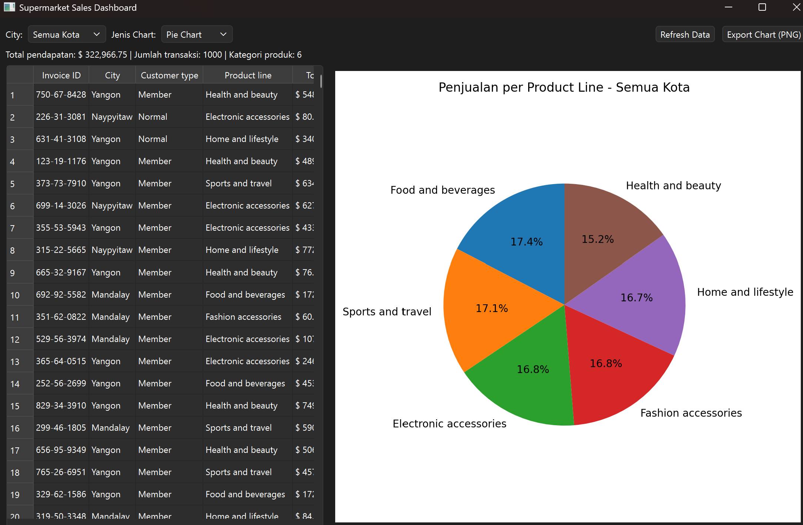
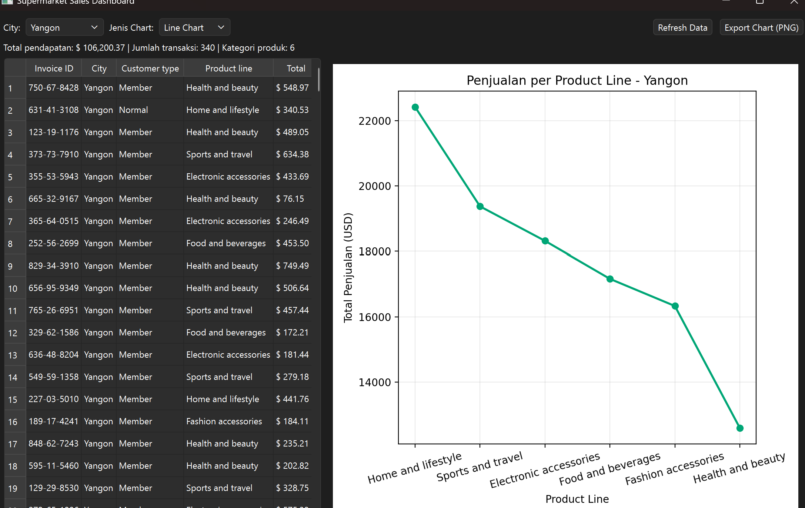
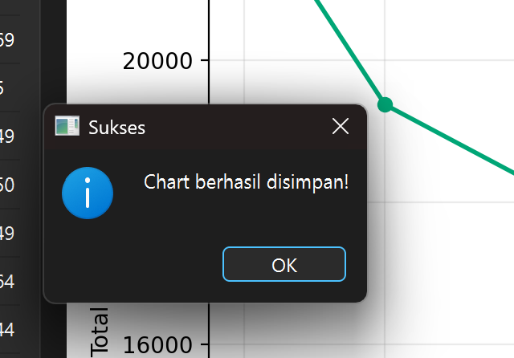

# T7-week12

"""
Nama    : Cindy Natasya Aulia Putri
NIM     : F1D02310109
Kelas   : C

## 📌 Sorotan Fitur

1. **Integrasi Dataset Nyata (Kaggle):** Aplikasi langsung memproses data transaksi mentah dari *Supermarket Sales Dataset* (Kaggle), memastikan visualisasi yang dihasilkan realistis dan bervariasi.
2. **Tabel Data Interaktif (Read):** Menampilkan ringkasan data transaksi (Invoice ID, City, Customer type, Product line, Total) secara terstruktur di dalam komponen `QTableWidget`.
3. **Visualisasi Fleksibel (Multi-Chart):** Menyediakan tiga pilihan grafik (*Bar Chart*, *Line Chart*, dan *Pie Chart*) yang di-*render* langsung (embedded) di dalam jendela aplikasi PySide6 tanpa membuka *window* terpisah.
4. **Sistem Filter Dinamis:** Memungkinkan penyaringan data berdasarkan lokasi cabang supermarket (City). Saat filter diubah, tabel, ringkasan metrik (Total Pendapatan, Jumlah Transaksi), dan grafik akan otomatis menghitung ulang dan menyesuaikan tampilannya secara *real-time*.
5. **Ekspor Laporan & Refresh Data:** Dilengkapi tombol **Export Chart (PNG)** untuk menyimpan grafik hasil analisis ke dalam format gambar beresolusi tinggi (300 dpi), serta tombol **Refresh Data** untuk memuat ulang *state* aplikasi jika sumber file CSV mengalami perubahan.

## 🛠️ Desain Arsitektur (Separation of Concerns)

Proyek ini dibagi menjadi 4 berkas terpisah untuk menjaga kebersihan kode dan kemudahan skalabilitas:

### 1. `data_loader.py` (Data & Logic Layer)
Modul ini bertugas sebagai mesin pengolah data menggunakan *library* Pandas.
* **Pembersihan & Transformasi:** Menangani pemuatan data CSV secara aman, mengatasi perbedaan penamaan kolom (*mapping* `Sales` menjadi `Total`), dan memastikan tipe data angka (*numeric*) sudah tepat.
* **Agregasi Data:** Menyediakan fungsi `summarize_data` yang merangkum ribuan baris transaksi menjadi metrik total pendapatan berdasarkan kategori produk (*Product line*), lalu mengurutkannya untuk keperluan visualisasi.

### 2. `chart_widget.py` (Visualization Layer)
Komponen penengah antara PySide6 dan Matplotlib.
* **Embedded Canvas:** Membangun `FigureCanvasQTAgg` agar kanvas grafik Matplotlib dapat ditanamkan dengan mulus ke dalam *layout* PySide6.
* **Logika Plotting:** Bertanggung jawab penuh atas logika penggambaran grafik (warna, penanda/marker, putaran teks sumbu agar tidak tumpang tindih) berdasarkan input data yang sudah teragregasi. Menyediakan juga metode enkapsulasi untuk mengekspor figur ke format PNG.

### 3. `dashboard_window.py` (View & Controller Layer)
Jendela antarmuka utama tempat pengguna berinteraksi.
* **Manajemen Layout:** Merakit seluruh komponen visual (ComboBox, Label, Button, Tabel, dan Canvas Grafik) menggunakan perpaduan `QVBoxLayout` dan `QHBoxLayout` sehingga UI tetap rapi dan proporsional saat jendela di-*resize*.
* **Event Handling:** Menangkap interaksi pengguna (perubahan pada *dropdown* filter kota atau jenis grafik) dan mendistribusikan perintah tersebut ke *data loader* untuk kalkulasi ulang dan ke *chart widget* untuk *render* ulang grafis.

### 4. `main.py` (The Entry Point)
Berkas eksekusi utama (Orchestrator). Berfungsi sangat ringkas sebagai inisiator *loop* aplikasi (QApplication) yang memanggil dan merender `DashboardWindow` ke layar.

## 📊 Sumber Dataset

Dataset yang digunakan berasal dari Kaggle:
[Supermarket Sales Dataset](https://www.kaggle.com/datasets/faresashraf1001/supermarket-sales)